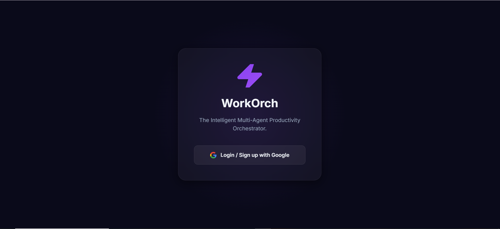
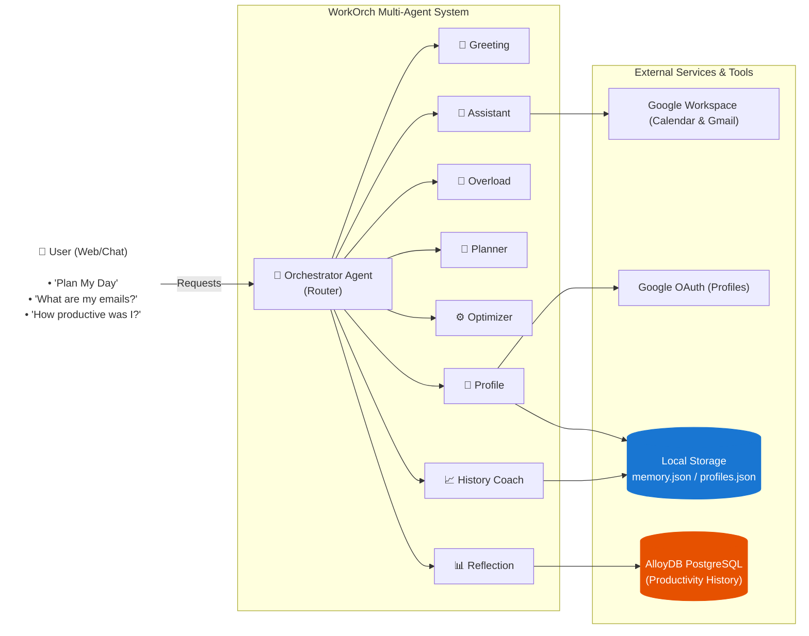

# 🚀 WorkOrch: The Intelligent Multi-Agent Productivity Orchestrator

<div align="center">
  
</div>


WorkOrch is a state-of-the-art conversational multi-agent system built with the [Google ADK](https://github.com/google/google-agent-sdk). It helps you manage your day securely, prioritize deep work, fetch your actual emails and calendar events, calculate your productivity metrics, and review historical performance! Powered by **Gemini 2.5 Flash**, it is hosted on a sleek FastAPI web dashboard featuring user-friendly Google OAuth Authentication.

---

## ✨ Features and Architecture

### System Architecture


The platform uses an intelligent **Orchestrator Agent** that determines the intent of your natural language requests and dynamically delegates them to one of **eight specialized sub-agents**:

1. **👋 Greeting Agent**: Gives personalized welcome messages and feature previews.
2. **👤 Profile Agent**: Collects and retains your working preferences, goals, and syncs seamlessly via Google OAuth login.
3. **🚨 Overload Agent**: Calculates task durations against your scheduled hours to warn you before you over-commit.
4. **📅 Planner Agent**: Constructs structured, optimized blocking schedules based on priorities and duration.
5. **⚙️ Optimizer Agent**: Replans your day automatically when you finish early, run late, or emergencies happen.
6. **📊 Reflection Agent**: Computes completion rates and "deep work" hours, saving end-of-day reports globally to Google Cloud AlloyDB.
7. **📈 History Coach Agent**: Analyzes your archived JSON memory logs to surface trends, streaks, and personalized productivity coaching.
8. **🤖 Assistant Agent**: Fetches your live Upcoming Events from Google Workspace Google Calendar and Unread Emails from Gmail.

### Application Layout
- `workorch/app.py`: The FastAPI server enabling the conversational dashboard and Google OAuth integration.
- `workorch/agent.py`: The master agent definitions cleanly structured into one readable file.
- `tools/`: The fully separated repository containing deterministic logic (`auth_tools.py`, `memory_store.py`, `scheduler.py`, `profile_tools.py`, etc.).
- `workorch/google_tools.py` & `workorch/auth.py`: Live integration logic for the Workspace APIs.

---

## 💻 Setup & Installation Guide

### 1. Prerequisites
- Python 3.10+
- Database: PostgeSQL dependencies (`psycopg2`) installed
- Google Cloud Project with the **Gemini API** enabled, and **AlloyDB** configured.

### 2. General Setup
1. **Clone the repository and enter the directory**:
   ```bash
   git clone <repo_url>
   cd "Google ADK"
   ```
2. **Activate the Virtual Environment**:
   ```powershell
   # Windows
   .\.venv\Scripts\activate
   ```
3. **Install Dependencies**:
   ```bash
   pip install -r requirements.txt
   ```
   *(Ensure you also run `pip install psycopg2` or `pip install psycopg2-binary` for the database connector).*

### 3. Environment Variables (`.env`)
Create a `.env` file inside the `workorch/` directory containing your necessary keys:
```env
# Gemini Auth
GEMINI_API_KEY=your_gemini_api_key_here

# AlloyDB Postgres Setup
ALLOYDB_HOST=127.0.0.1
ALLOYDB_USER=postgres
ALLOYDB_PASSWORD=your_secure_password
ALLOYDB_DB_NAME=productivity_db
```

### 4. Setting up Google OAuth & credentials.json
To enable Google Authentication and Workspace integrations (Gmail, Calendar), you must configure a Google Cloud Console project and download your OAuth credentials:
1. Go to the [Google Cloud Console](https://console.cloud.google.com/).
2. Create a new project or select an existing one.
3. Enable the **Google Calendar API** and **Gmail API** in the "APIs & Services" > "Library" section.
4. Navigate to **"APIs & Services" > "OAuth consent screen"** and configure it. Add the necessary scopes for reading calendar and email data.
5. Navigate to **"APIs & Services" > "Credentials"**.
6. Click **"Create Credentials"** and select **"OAuth client ID"**.
7. Choose **"Web application"** as the application type.
8. Set the "Authorized redirect URIs". For local development, add `http://localhost:8000/auth/callback`.
9. Click **"Create"**, then click **"Download JSON"** to download the credentials.
10. Rename the downloaded file to `credentials.json`, and place it in the `workorch/` directory (i.e. `workorch/credentials.json`).

### 5. Setting up Google Cloud AlloyDB
The Reflection Agent commits your productivity summaries to a PostgreSQL AlloyDB cluster to achieve secure global persistence.
1. [Create an AlloyDB Cluster](https://codelabs.developers.google.com/quick-alloydb-setup?hl=en#0).
2. Download and run the **AlloyDB Auth Proxy** to securely connect locally over port `5432`:
   ```bash
   ./alloydb-auth-proxy "projects/YOUR_PROJECT/locations/YOUR_REGION/clusters/YOUR_CLUSTER/instances/YOUR_INSTANCE"
   ```
3. Connect using AlloyDB Studio or a local SQL client, and execute:
   ```sql
   CREATE DATABASE productivity_db;
   \c productivity_db;
   CREATE TABLE productivity_history (
       id SERIAL PRIMARY KEY,
       summary TEXT NOT NULL,
       created_at TIMESTAMP WITH TIME ZONE DEFAULT CURRENT_TIMESTAMP
   );
   ```

### 6. Start the Application!
Start the FastAPI server through Python:
```bash
cd workorch
python app.py
```
Visit **http://localhost:8000** in your browser. You can click "Login with Google" on the sleek glassmorphism interface to securely authenticate and automatically generate your user profile.

---

## 💬 Example Prompts to Test Every Agent

You can test the entire workflow of the platform using these sample conversational prompts. The Orchestrator will automatically route the queries!

### 👋 Greetings & 👤 Profile
* *"Hey there!"* or *"Good morning WorkOrch!"* (Greeting Agent)
* *"Who am I?"* or *"Can you setup my profile?"* (Profile Agent)
* *"My name is Alex. I work from 8 to 4 and my goal is to launch this app."* (Profile Agent - Manual setup)

### 🤖 Assistant (Calendar & Email Hooks)
* *"What is on my calendar for today?"* or *"Do I have any meetings coming up?"*
* *"Read me my latest unread emails."*

### 🚨 Overload & 📅 Planner
* *"I have 5 tasks: coding (priority 10, 4 hours), emails (priority 5, 2 hours), meeting (priority 8, 1 hour), review PRs (priority 4, 3 hours). Available time: 7.5 hours. Please plan my day."* 
*(This will trigger Overload Agent to warn you of excess tasks, then Planner Agent will create the structured list).*

### ⚙️ Optimizer
* *"I finished my 1-hour meeting early. Please adjust my schedule for the rest of the day."*
* *"I just completed the coding task. Replanning please."*

### 📊 Reflection & 📈 History Coach
* *"I'm done for the day! I completed my coding and meeting items, but skipped emails. Save my metrics to the database."* (Reflection Agent - hits AlloyDB)
* *"Analyze my historical productivity. How have I been doing this week?"* (History Coach Agent - reads patterns from `memory.json`)
* *"What is my current streak? Give me some coaching."* (History Coach Agent)
